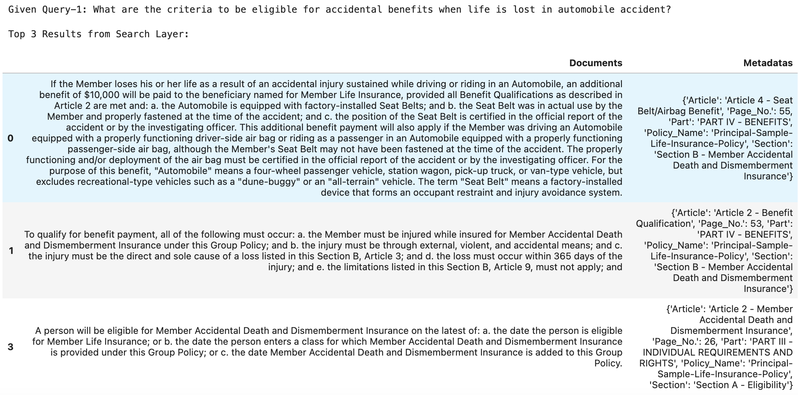
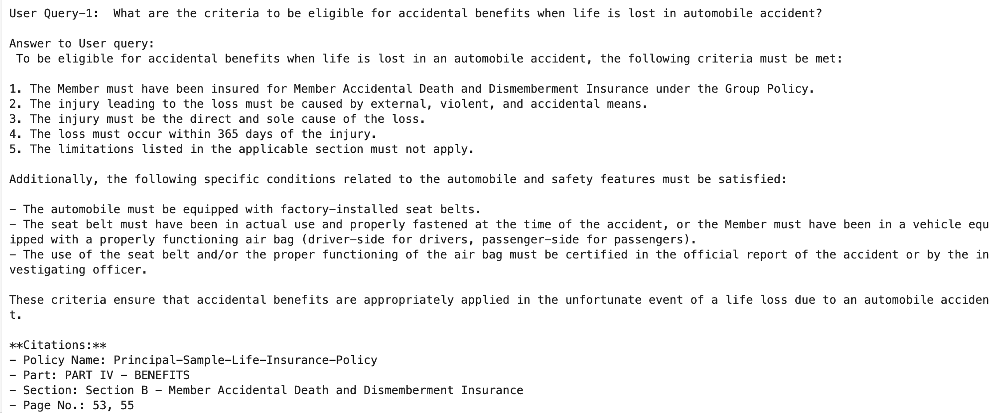
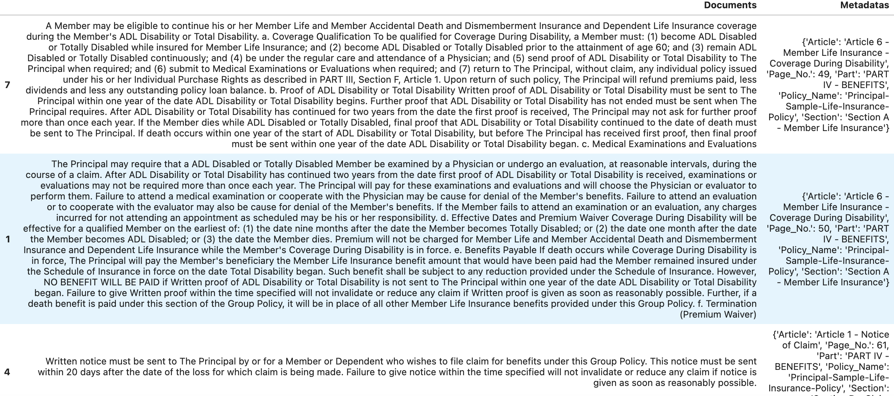
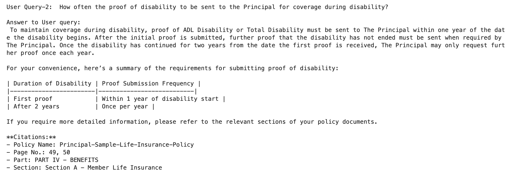
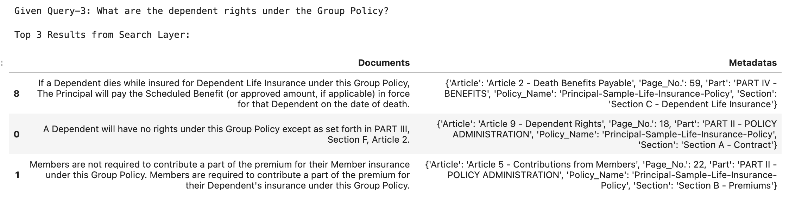
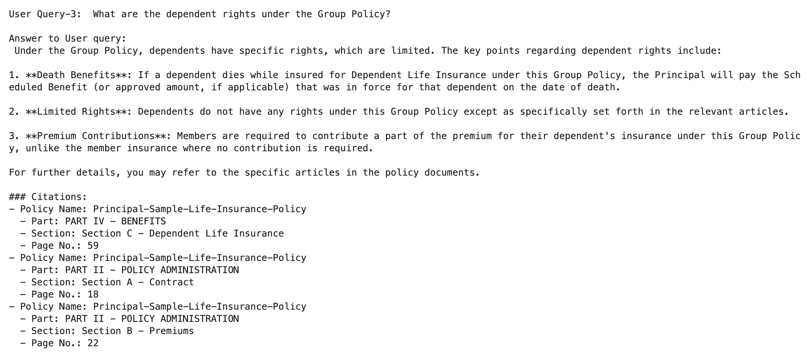

# **HelpMate AI - Life Insurance Chatbot Powered by ChromaDB RAG**

## **Table of Contents**
* [Project Goal](#1-project-goal)
* [Data Sources](#2-data-sources)
* [System Design](#3-system-design)
* [Execution Approach](#4-execution-approach)
* [Technology Used](#5-technology-used)
* [Results Achieved](#6-results-achieved)
* [Challenges Faced](#7-challenges-faced)
* [Conclusion](#8-conclusion)
* [Acknowledgements](#9-acknowledgements)

## **1. Project Goal**
Large Language Models (LLMs) are trained on vast amounts of publicly available data but lack access to **company-specific** knowledge, making them unsuitable for answering detailed queries about proprietary documents such as Group Life Insurance policies. Traditional LLM-based chatbots may generate **hallucinated responses**, providing misleading or incomplete information due to the absence of domain-specific data in their training corpus. **Retrieval-Augmented Generation (RAG)** addresses this limitation by integrating an external knowledge retrieval system with an LLM, enabling it to fetch relevant document chunks before generating responses. 

By leveraging ChromaDB as a vector database, **HelpMate AI** aims to efficiently retrieve and rank relevant sections from the company’s policy document, ensuring accurate, contextually rich answers. This hybrid approach would enhance reliability, prevent misinformation, and make AI-driven interactions more aligned with the company’s specific policies and guidelines.

## **2. Data Sources**
The primary data source for this project was the **Group Life Insurance Policy** PDF document. This document contains detailed policy terms, conditions, benefits, exclusions, and claims processes, structured under multiple hierarchical levels: **Parts, Sections, and Articles**.

## **3. System Design**
### **Activity Flow**
The **HelpMate AI** system follows a structured workflow:
1. User submits a query related to the Group Life Insurance Policy.
2. The system retrieves the **most relevant document chunks** from ChromaDB.
3. The retrieved chunks, along with metadata, are passed to the LLM.
4. The LLM generates a response while **citing relevant Parts, Sections, and Articles** for reference.
5. The system returns the response to the user in a structured and readable format.

### **Chunking Strategy**
To ensure accurate and meaningful retrieval, the following **chunking strategy** was adopted:
- The text is laid out at **three levels** - **Part, Section, and Article**, forming the metadata.
- **Chunking occurs at the Article level**, as it contains all the information about a policy sub-topic.
- If an **Article exceeds 500 words**, it is **split into multiple chunks**.
- **Overlapping of 50 words (10% of max chunk size)** is maintained between split chunks for context continuity.
- **Table of Content and Footer texts are discarded** to eliminate noise and improve retrieval quality.

## **4. Execution Approach**
The project execution involved the following steps:
1. **Extracting structured content** from the Group Life Insurance Policy.
2. **Preprocessing the text** (removing headers, footers, redundant whitespace, etc.).
3. **Chunking the text** as per the defined strategy.
4. **Generating embeddings** using appropriate Embedding model.
5. **Storing embeddings in ChromaDB** for efficient retrieval.
6. **Implementing the RAG pipeline** to retrieve and rerank relevant document sections.
7. **Passing the retrieved documents to LLMs** for generating responses.
8. **Optimizing LLM interactions** for different models (OpenAI, LLaMA-3, Hugging Face models).
9. **Evaluating response quality** for different test queries.

## **5. Technology Used**
| **Component** | **Technology Used** |
|--------------|------------------|
| **LLM** | OpenAI GPT, LLaMA-3 (via Replicate) |
| **Vector Database** | ChromaDB |
| **Embedding Model** | `text-embedding-ada-002` (OpenAI), all-MiniLM-L6-v2 |
| **Chunking & Preprocessing** | Python (NLTK, Pandas) |
| **Retrieval Model** | Semantic Search (ChromaDB) |
| **Reranking Model** | Cross-Encoder (`ms-marco-MiniLM-L-6-v2`, `ms-marco-TinyBERT-L-6`) |
| **Application Framework** | Python Notebook |

In terms of performance, there were no significant difference in quality observed among the Embedding Models, Cross-Encoder models and LLM models. This may be because the input document was well structured leaving little possibility for ambiguity in search. 

## **6. Results Achieved**
The **HelpMate AI** system was successfully able to answer **insurance policy-related queries** with high accuracy. Below are placeholders for test cases:

### **Example Query Results**
#### **Query 1:** *What are the criteria to be eligible for accidental benefits when life is lost in automobile accident?*
- **Retrieved RAG Document Snapshots**

- **LLM Response Snapshot**

#### **Query 2:** *How often the proof of disability to be sent to the Principal for coverage during disability?*
- **Retrieved RAG Document Snapshots**

- **LLM Response Snapshot** *(Attach screenshot here)*

#### **Query 3:** *What are the dependent rights under the Group Policy?*
- **Retrieved RAG Document Snapshots**

- **LLM Response Snapshot** *(Attach screenshot here)*

## **7. Challenges Faced**
The following challenges were encountered and resolved during the project:
- **Extracting Parts, Sections, and Articles** from the policy document was challenging due to inconsistent formatting.
- **Handling multiple LLMs** was complex because OpenAI models and Hugging Face models have different APIs. A **common function** was implemented to unify API calls.
- **LLaMA-3 model execution** required using **Replicate** as direct API access was not available.

## **8. Conclusion**
The **HelpMate AI** system effectively addresses company-specific Group Life Insurance policy queries with **high accuracy and contextual relevance** by leveraging a **Retrieval-Augmented Generation (RAG)** approach. Unlike generic LLM-based chatbots, this system retrieves precise excerpts from the policy document and provides **detailed responses** with citations, specifying the **relevant Part, Section, and Article along with Page Numbers** for further reference. The **chunking strategy** adopted ensures that the retrieved context is well-structured, allowing the LLM to generate accurate answers. By chunking at the **Article level**, maintaining **context continuity through overlapping text**, and filtering out **irrelevant content** like table of contents and footers, the system optimally feeds structured knowledge into the LLM. **RAG-based solutions like HelpMate AI play a crucial role in aligning chatbot responses with an organization's specific policies, ensuring reliability, compliance, and trust in AI-driven assistance.**

## **9. Acknowledgements**

This case study has been developed as part of Post Graduate Diploma Program on Machine Learning and AI, offered jointly by Indian Institute of Information Technology, Bangalore (IIIT-B) and upGrad.

